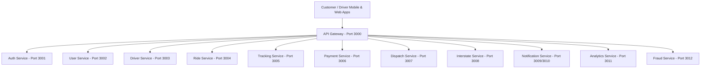

# FlexRide 🚗💨

Welcome to **FlexRide**, a high-performance, production-ready ride-hailing platform designed to match the capabilities of global leaders like Bolt and Uber. Built with a distributed microservices backend (12 independent NestJS services), a Next.js administrative control center, and Flutter mobile applications for both customers and drivers.

---

## 🏗️ System Architecture Overview

The system is split into three main layers:



### 1. Web & Mobile Frontends
* **Admin Dashboard** (`/admin-dashboard`): Built with Next.js 16 (Turbopack) using TypeScript. It includes dashboards for Live Operations, Finance, and KYC Support.
* **Customer Mobile App** (`/customer_app`): Native cross-platform app written in Flutter. Integrates Riverpod for state management, Dio for HTTP networking, GoRouter for navigation, and Google Maps.
* **Driver Mobile App** (`/driver_app`): Native cross-platform app written in Flutter. Shares the clean architecture pattern of the customer app.

### 2. Backend Microservices (`/backend`)
Every microservice is built using **NestJS** and communicates over HTTP, WebSocket (Socket.IO), or Redis Pub/Sub.
* **api-gateway** (Port `3000`): Consolidates client endpoints and forwards requests to underlying microservices.
* **auth-service** (Port `3001`): Handles email registration, JWT validation, refresh tokens, phone OTP verification, and Social OAuth.
* **user-service** (Port `3002`): Manages customer profiles, favorite locations, and emergency contacts.
* **driver-service** (Port `3003`): Manages driver profiles, KYC documents verification status, and ratings.
* **ride-service** (Port `3004`): Handles ride creation, stop sequences, bids, and pricing estimation.
* **tracking-service** (Port `3005`): Performs real-time geofencing and updates current driver coordinates using Redis Geospatial.
* **payment-service** (Port `3006`): Integrates major payment providers (Paystack, Flutterwave, Monnify, OPay) and coordinates wallet balances.
* **dispatch-service** (Port `3007`): Matches rides with active drivers via Socket.IO events.
* **interstate-service** (Port `3008`): Books inter-state passenger seats and private charters.
* **notification-service** (Port `3009`): Delivers SMS, push notifications, and hosts real-time chat sockets.
* **analytics-service** (Port `3011`): Predicts ride demand and tracks platform-wide financial records.
* **fraud-service** (Port `3012`): Analyzes GPS spoofing and flags suspicious transactions.

---

## 🔑 Access Credentials & Authentication

To ease local development and testing, default user accounts are automatically seeded into the database upon startup.

### 1. Administrative Control Center
Use these credentials to sign in to the **Admin Dashboard** at `http://localhost:3000/login`:
* **Administrator Email**: `joshuaomatsuli01@gmail.com`
* **Default Password**: `Jos@56567`
* **Role**: `ADMIN` (with full system `["*"]` permissions)

### 2. Mobile App Authentication (Customers & Drivers)
Authentication in the mobile apps uses **Phone OTP**:
1. Request an OTP by submitting a phone number.
2. In **development/testing** environments, the OTP is returned directly in the response body payload as `devOtp` (no real SMS charges incurred).
3. Submit the received 6-digit OTP code to authorize and automatically register/login.

---

## 🚀 Local Development Setup

### Prerequisites
Make sure you have the following installed on your machine:
* [Docker Desktop](https://www.docker.com/products/docker-desktop/)
* [Node.js v18+](https://nodejs.org/)
* [Flutter SDK](https://docs.flutter.dev/get-started/install)

### 1. Booting the Ecosystem
We supply a master boot script that brings up PostgreSQL, Redis, and all 12 backend microservices in Docker containers:
```powershell
# Navigate to the backend directory and boot
cd backend
.\start_flexride.ps1
```
* **Database (PostgreSQL)** is exposed on port `5432`.
* **Cache (Redis)** is exposed on port `6379`.

### 2. Running the Admin Dashboard
```powershell
cd admin-dashboard
npm install
npm run dev
```
Open your browser to `http://localhost:3000`.

### 3. Launching Mobile Apps
```powershell
# Run the customer application
cd customer_app
flutter pub get
flutter run

# Run the driver application
cd driver_app
flutter pub get
flutter run
```

---

## 🔬 Validation & Launch Gate Verification

Before code is pushed to production, it must pass a strict launch gate that runs syntax checks, type checks, unit tests, and verifies coverage against the production readiness checklist.

### 1. Automated Checklist Verifier
We have written a high-performance verification script that checks the repository for required paths, schemas, files, and packages:
```powershell
.\scripts\verify-production-readiness.ps1
```
*This script is optimized using an in-memory path cache and a queue-based Breadth-First Search (BFS) that prunes `node_modules` folders, completing in under a minute.*

### 2. Full Monolithic Launch Gate
This builds all microservices, runs their test suites, builds the administrative dashboard, and verifies the mobile apps:
```powershell
.\scripts\verify-launch-gate.ps1
```
For a backend/admin-only validation (skipping slow Flutter environment analyses):
```powershell
.\scripts\verify-launch-gate.ps1 -SkipMobile
```

---

## 🗄️ Database Schema Summary

The database uses PostgreSQL 15+ with the schema defined in [schema.sql](file:///c:/FlexRide/backend/database/schema.sql).

### Key Tables:
* `users` / `admin_users` / `drivers`: Core profile records and Role-Based Access Control (RBAC).
* `rides` / `ride_stops` / `ride_bids` / `scheduled_rides`: Booking flow tracking.
* `wallets` / `wallet_transactions` / `payments`: FinTech core.
* `sos_alerts` / `trip_shares` / `trip_audio_recordings`: Emergency response tracking.
* `inter_state_routes` / `inter_state_trips` / `travel_bookings`: Long-distance routes.
